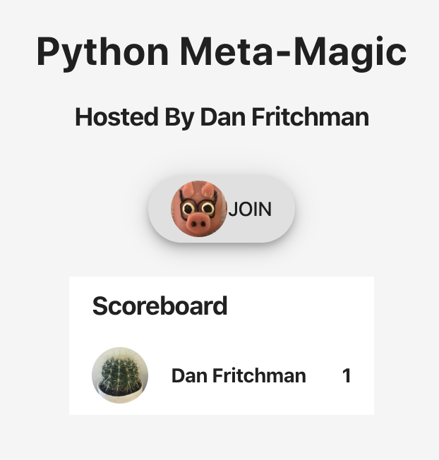
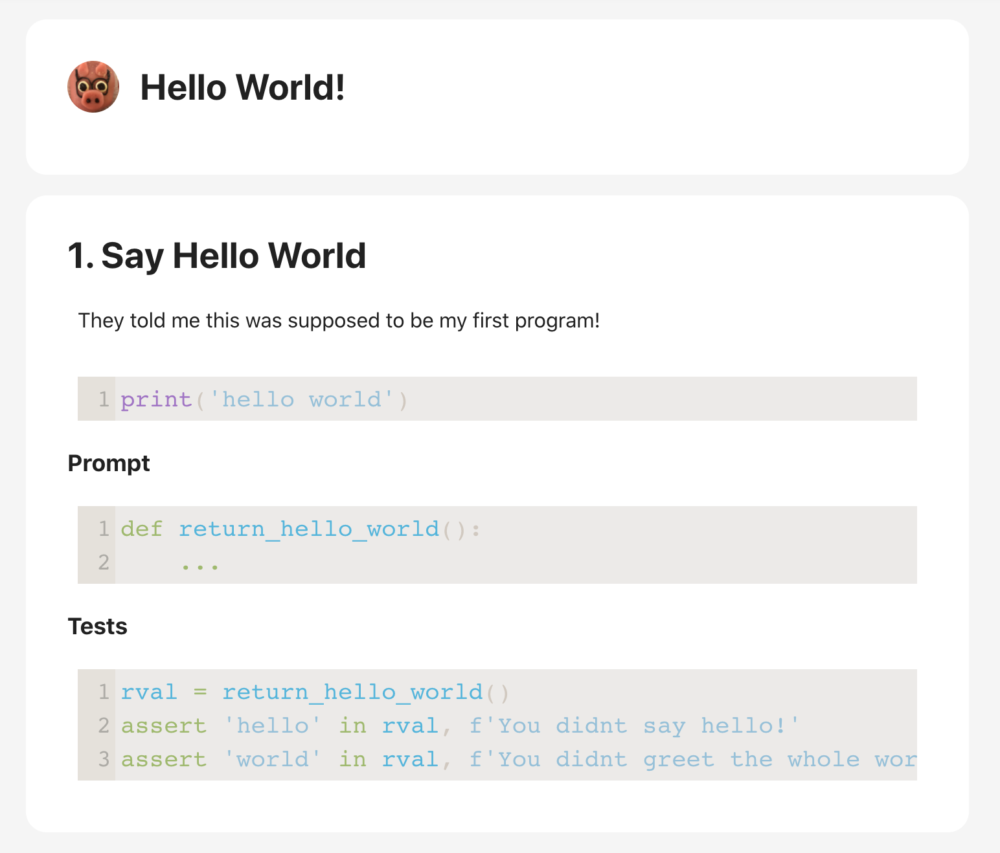
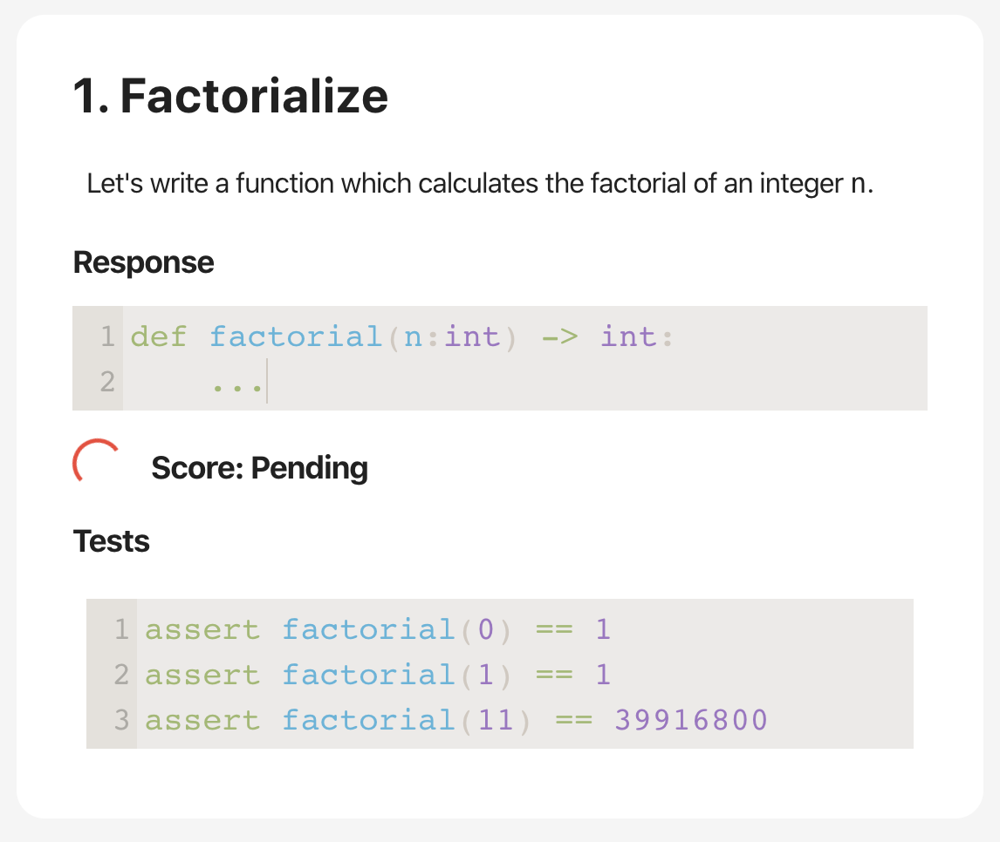
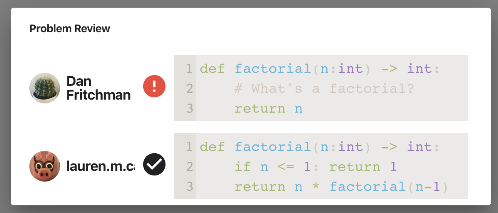
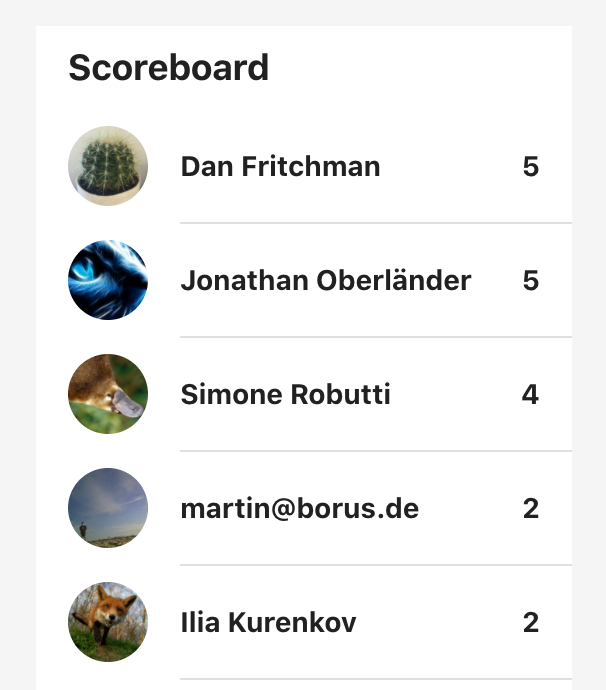

# KlassLive

Live, fun, notebook-based teaching & learning. https://klass.live

---

KlassLive is an online service for live, interactive teaching & learning. It's built on a few principles designed to get learners up and running ASAP in a fun, interactive environment. 

### No Setup, No Installation, Ever

KlassLive learners need one piece of information: a URL. They join live sessions via GitHub login and immediately enter a working environment prepared for the topic at hand. 

Hosts create these reusable environments beforehand, using Jupyter style notebooks and container technologies to specify and isolate their dependencies. 

 

Each Klass looks much like a Jupyter notebook. Hosts prepare a series of cells including a combination of code and markdown-based description. Each section then ends with a problem, including a code prompt for students, a set of auto-graded tests, and a (hidden) instructor-provided solution. Submissions are executed and graded on a back-end server environment configured by the host. 

### Keeping Up

KlassLive session-hosts can review and compare each participant's responses, either in public or private, to understand who's getting what. Each participant can use either past *solutions* or their own past responses to sequentially building problems. Incorrect solutions are automatically replaced with the solutions. Nobody is left behind at any point. 

### Fun!

Finally, KlassLive makes these sessions an interactive learning game. Responses are graded by instructor-provided methods, which can include metrics for breadth of correctness, execution time, and code density. A live scoreboard tracks where everyone stands, and allowed for rewards of the best answers over a problem or session. 

*(I Cheated)*

For more see KlassLive's introductory post on [Medium](https://medium.com/@dan_fritchman/open-source-live-notebook-based-teaching-learning-41b2f7436fc3) or [Dan's Blog](https://dan.fritch.mn/klasslive-intro). Or jump right in at https://klass.live! 

